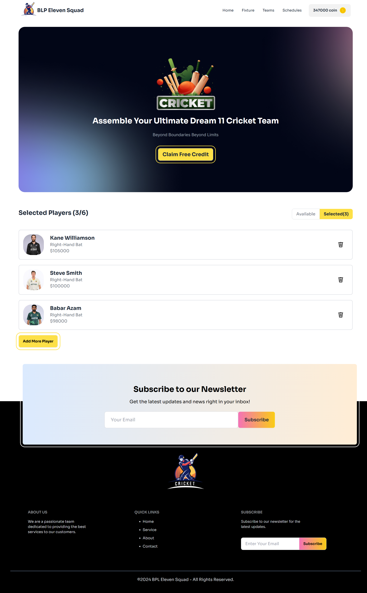

# BPL Eleven Squad

## Project Name: BPL Eleven Squad

### A brief description: 
- BPL Eleven Squad is an interactive platform that allows users to assemble their dream BPL cricket team by choosing players, managing coins, and strategizing their team selection to win big. The platform brings cricket enthusiasts closer to the game by providing an engaging fantasy cricket experience.This project aims to reinforce React core concepts.

---

### Technologies Used:

- React.js for building the interactive user interface
-  React State Management for handling player selection and coin balance
-  React Toastify for user notifications
-  Surge for deploying the website

### Key Features:

- Coin Management System: Users can manage their coin balance, with options to add free credits. 
- Player Selection Limitations: Select up to six players to build the ultimate team.
- Dynamic Header Update: Coin balance is updated in real-time in the header as users manage their team.

### Dependencies:
- prop-types: ^15.8.1
- react: ^18.3.1
- react-dom: ^18.3.1
- react-toastify: ^10.0.6

### How to run on local machine?
1. Open your terminal or command prompt.

2. Use the git clone command followed by the repository URL:-  git clone 'repository-url'

- Replace 'repository-url' with the actual URL of the Git repository you want to clone.

3. To run the project: Navigate to the project directory:- cd 'directory-name' 

4. Run 'npm install' to install project dependencies.

5. Run 'npm run dev' to run the project locally.

##  Live Link: 
### 1. Netlify : [BPL Eleven Squad](https://bpl-eleven-squad.netlify.app/)
### 2. Surge : [BPL Eleven Squad](https://bpl-eleven-squad.surge.sh/)

##  Site Preview: 
 

  
   
  
   

